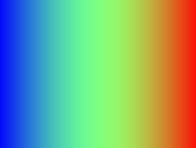

# Week-01 Task

Experimenting with pixels gradients and colors.

## Requirements

Written in Processing 4.3

No special libraries required.

## Operation

Run `gradient_example.pde` in Processing.

## Screengrab

## Design notes
